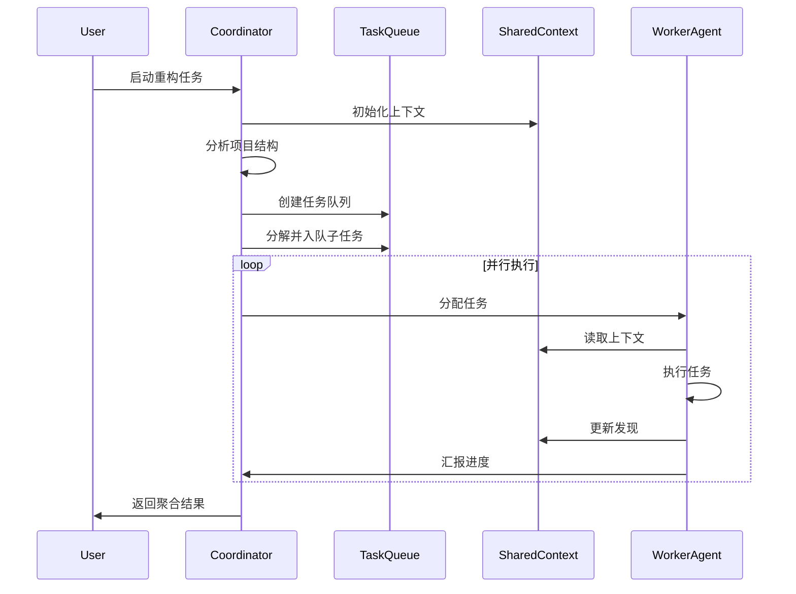

# Honeycomb 架构设计文档

## 概述

Honeycomb（蜂巢）是一个多 Agent 协作系统，用于大型代码项目的重构与分析任务。系统通过一组可独立运行、又能通过中心协调器协同工作的 Agents，实现任务分解、子任务并行、上下文共享、状态追踪等能力。

## 设计理念

### 蜂巢类比

```
         🐝 Queen (协调器)
            /    |    \
           /     |     \
          /      |      \
    Worker1  Worker2  Worker3 ... WorkerN
      🐝      🐝       🐝          🐝
```

- **Queen (女王蜂)**: 中心协调器，负责任务分解、分配和监控
- **Worker (工作蜂)**: 独立的 Agent，执行具体的代码分析/重构任务
- **Hive (蜂巢)**: 共享上下文和知识库
- **Honeycomb Cells (蜂窝格)**: 任务队列和状态追踪

## 核心组件

### 1. HoneycombCoordinator (中心协调器)

**职责**:

- 任务分解：将大型任务拆解为可并行的子任务
- 任务分配：根据 Agent 状态和负载分配任务
- 依赖管理：处理任务间的依赖关系
- 进度监控：实时追踪所有任务状态
- 结果聚合：收集和整合各 Agent 的执行结果

**特性**:

- 支持动态任务优先级调整
- 智能负载均衡
- 自动重试和错误恢复
- 任务依赖图管理

### 2. WorkerAgent (工作 Agent)

**职责**:

- 独立执行分配的子任务
- 与中心协调器通信汇报状态
- 从共享上下文读取信息
- 向共享上下文写入发现和结果

**特性**:

- 轻量级，可快速启动
- 支持多种任务类型（分析、重构、测试等）
- 独立的错误隔离
- 可配置的并发数

### 3. SharedContext (共享上下文层)

**职责**:

- 存储项目级别的知识（架构、依赖关系等）
- Agent 间的信息共享
- 避免重复工作（缓存已分析的文件）
- 记录全局状态变化

**数据结构**:

```typescript
{
  projectMetadata: {
    structure: ProjectStructure,
    dependencies: DependencyGraph,
    conventions: CodingStandards
  },
  fileAnalysisCache: Map<string, FileAnalysis>,
  globalFindings: Finding[],
  crossFileReferences: ReferenceMap
}
```

### 4. TaskQueue (任务队列系统)

**职责**:

- 管理待处理任务队列
- 支持优先级调度
- 处理任务依赖关系
- 并发控制

**队列类型**:

- **高优先级队列**: 紧急或阻塞性任务
- **普通队列**: 常规任务
- **低优先级队列**: 可延迟的优化任务

### 5. StateTracker (状态追踪系统)

**职责**:

- 追踪所有 Agent 状态（空闲、工作、错误）
- 追踪任务执行状态
- 提供实时进度查询
- 生成执行报告

**状态类型**:

```typescript
AgentState: "idle" | "busy" | "error" | "terminated"
TaskState: "pending" | "assigned" | "running" | "completed" | "failed" | "cancelled"
```

### 6. CommunicationBus (通信总线)

**职责**:

- Agent 与协调器间的消息传递
- Agent 间的协作通信
- 事件发布/订阅

**消息类型**:

- TaskAssignment: 任务分配
- TaskProgress: 进度更新
- TaskComplete: 任务完成
- ContextUpdate: 上下文更新
- AgentHealthCheck: 健康检查

## 工作流程

### 1. 任务启动流程



### 2. 任务分解策略

**文件级并行**:

- 将文件列表拆分为多个批次
- 每个 Agent 处理一个或多个文件
- 适用于独立的文件重构任务

**功能级并行**:

- 按功能模块划分任务
- 例如：代码审查、性能分析、安全扫描
- 不同 Agent 执行不同类型的分析

**依赖感知并行**:

- 构建文件依赖图
- 优先处理被依赖的文件
- 依赖项完成后触发后续任务

### 3. 上下文共享机制

**写入策略**:

- Agent 完成任务后立即写入发现
- 使用乐观锁避免冲突
- 重要更新触发通知

**读取策略**:

- Agent 启动时加载相关上下文
- 执行过程中可查询最新状态
- 缓存常用信息减少查询

### 4. 错误处理与恢复

**Agent 级错误**:

- 自动重启失败的 Agent
- 将任务重新分配给其他 Agent
- 记录错误日志供分析

**任务级错误**:

- 根据错误类型决定重试策略
- 超过重试次数标记为失败
- 不阻塞其他任务执行

**系统级错误**:

- 协调器故障时保存状态快照
- 支持从检查点恢复
- 避免全部任务重新执行

## 并发控制

### Agent 池管理

```typescript
class AgentPool {
  maxConcurrency: number // 最大并发数（例如 10）
  agents: WorkerAgent[] // Agent 实例池

  // 动态调整策略
  - 初始启动少量 Agent
  - 根据任务队列长度动态扩容
  - 空闲时回收 Agent 资源
}
```

### 资源限制

- **CPU 限制**: 避免过多并发导致系统卡顿
- **内存限制**: 控制同时加载的文件数量
- **API 限制**: 控制对 LLM API 的并发调用
- **文件系统限制**: 避免过多文件操作冲突

## 配置选项

```typescript
interface HoneycombConfig {
	// 并发配置
	maxConcurrentAgents: number // 最大并发 Agent 数（1-20）

	// 任务配置
	taskBatchSize: number // 每个 Agent 一次处理的文件数
	taskTimeout: number // 单个任务超时时间（秒）
	maxRetries: number // 任务失败最大重试次数

	// 依赖配置
	enableDependencyAnalysis: boolean // 是否启用依赖分析

	// 上下文配置
	enableSharedContext: boolean // 是否启用上下文共享
	contextCacheSize: number // 上下文缓存大小（MB）

	// 通信配置
	heartbeatInterval: number // 心跳间隔（秒）
	progressReportInterval: number // 进度汇报间隔（秒）
}
```

## 性能优化

### 1. 智能任务分配

- **工作窃取**: 空闲 Agent 主动获取任务
- **负载均衡**: 考虑文件大小和复杂度
- **本地性优化**: 相关文件分配给同一 Agent

### 2. 缓存策略

- **文件内容缓存**: 避免重复读取
- **分析结果缓存**: 复用已分析的信息
- **LLM 响应缓存**: 相似任务复用结果

### 3. 增量处理

- **变更检测**: 只处理修改的文件
- **检查点机制**: 支持中断恢复
- **增量更新**: 基于上次结果进行更新

## 监控与可观测性

### 实时指标

- 活跃 Agent 数量
- 任务队列长度
- 平均任务执行时间
- 成功率和失败率
- 资源使用情况（CPU、内存）

### 可视化界面

```
┌─────────────────────────────────────────┐
│ Honeycomb 控制面板                       │
├─────────────────────────────────────────┤
│ 📊 总体进度: ████████░░ 80%             │
│ 🐝 活跃 Agents: 8/10                    │
│ 📋 待处理任务: 45                        │
│ ✅ 已完成: 320  ❌ 失败: 5              │
├─────────────────────────────────────────┤
│ Agent 状态:                              │
│ Agent-1: 🟢 处理 utils/helper.ts        │
│ Agent-2: 🟢 处理 components/Button.tsx  │
│ Agent-3: 🔴 错误 - 重试中...            │
│ ...                                      │
└─────────────────────────────────────────┘
```

## 扩展性

### 自定义 Agent 类型

```typescript
interface CustomAgent extends WorkerAgent {
	specialization: "refactor" | "analyze" | "test" | "document"
	execute(task: Task): Promise<Result>
}
```

### 插件系统

- 自定义任务分解策略
- 自定义结果聚合逻辑
- 自定义上下文存储后端
- 自定义通信协议

## 对比现有 Control 模式

| 特性       | Control 模式   | Honeycomb 模式 |
| ---------- | -------------- | -------------- |
| 执行方式   | 串行           | 并行           |
| 可扩展性   | 低             | 高             |
| 容错能力   | 一般           | 强             |
| 上下文共享 | 无             | 有             |
| 依赖处理   | 无             | 有             |
| 性能       | 慢（顺序执行） | 快（并发执行） |
| 复杂度     | 简单           | 中等           |
| 适用场景   | 小型项目       | 大型项目       |

## 迁移路径

### 阶段 1: 兼容模式

- Honeycomb 作为 Control 的可选模式
- 保留现有 API 接口
- 逐步迁移功能

### 阶段 2: 并行运行

- 两种模式共存
- 用户可选择使用哪种模式
- 收集性能对比数据

### 阶段 3: 完全迁移

- Honeycomb 成为默认模式
- Control 模式标记为 legacy
- 提供迁移工具和文档

## 使用示例

```typescript
// 创建 Honeycomb 协调器
const honeycomb = new HoneycombCoordinator({
	maxConcurrentAgents: 10,
	taskBatchSize: 5,
	enableSharedContext: true,
})

// 启动重构任务
await honeycomb.startTask({
	discoveryRule: "查找所有 React 组件文件",
	processingRule: "将类组件重构为函数组件",
	options: {
		enableDependencyAnalysis: true,
		prioritizeByComplexity: true,
	},
})

// 监听进度
honeycomb.on("progress", (progress) => {
	console.log(`进度: ${progress.percentage}%`)
})

// 等待完成
const result = await honeycomb.waitForCompletion()
console.log(`完成: ${result.completed}, 失败: ${result.failed}`)
```

## 总结

Honeycomb 架构通过引入多 Agent 协作、上下文共享、智能任务分配等机制，显著提升了大型项目重构和分析的效率和可靠性。该架构设计灵活、可扩展，适合复杂的代码维护场景。
